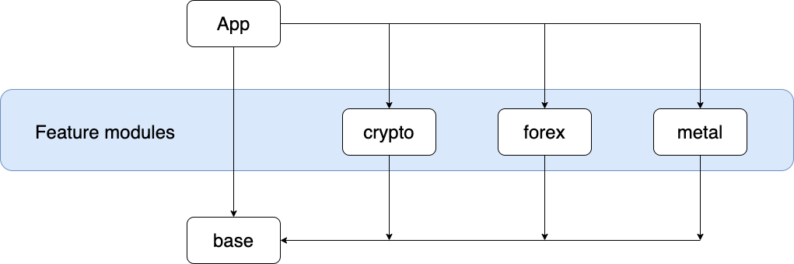

# Android Modularisation Example

## Architecture

This project contains the `app` module and 4 feature modules:

* `base` - this contains all shared code and test utilities
* `crypto` - feature to show crypto prices
* `forex` - feature to show exchange rate prices
* `metal` - feature to show silver/gold prices



The `app` module must:

* Depend on all feature modules.
* Depend on the `base` module. This is required because some items injected via DI are provided in the base module.

The feature modules must:

* Depend on the `base` module. This is required because some items injected via DI are provided in the base module.

## Dependency management

Each module has its own dependencies. These dependencies and their versions are provided via the `buildSrc` folder. The `buildSrc` folder is automatically compiled before anything else. This means you can declare dependencies in it and have all the other modules use these standardised dependencies.

Check out [Dependencies.kt](buildSrc/src/main/java/Dependencies.kt) to see the full list of dependencies for this project. 

For this project, we have the following objects available to all modules:

* `Versions` - versions for our dependencies
* `Libs` - libraries that should be registered with `implementation`
* `AnnotationLibs` - libraries that should be registered with `kapt`
* `UnitTestLibs` - libraries that should be registered with `testImplementation`
* `UITestLibs` - libraries that should be registered with `androidTestImplementation`
* `GradlePlugins` - gradle plugins to be registered in the root `build.gradle`

Example usages:

* `implementation Libs.coroutines`
* `kapt AnnotationLibs.dagger_hilt_compiler`
* `testImplementation UnitTestLibs.junit`
* `androidTestImplementation UITestLibs.espresso`
* `classpath GradlePlugins.kotlin`

## Code quality

The following code quality tools are used:

* [Android lint](http://tools.android.com/tips/lint) - scans Android code for bugs
* [Spotless](https://github.com/diffplug/spotless) - Runs [ktlint](https://github.com/pinterest/ktlint) to check Kotlin code & enforces [licence headers](https://github.com/diffplug/spotless/tree/main/plugin-gradle#license-header)
* [Detekt](https://github.com/detekt/detekt) - Static code analysis for Kotlin code

How to run the code quality tools:

* Run `./gradlew lint` to run Android lint
* Run `./gradlew detekt` to run Detekt
* Run `./gradlew spotlessCheck` to run Spotless (runs [ktlint](https://github.com/pinterest/ktlint) and checks licence headers)
* Run `./gradlew spotlessApply` to automatically apply Spotless suggestions
* Run `./gradlew check` to run all code quality checks and unit tests

## Spotless configuration

See [spotless.gradle](spotless.gradle) for the full configuration. In this file you can see the licence header that will be enforced in all Kotlin files.

## Testing

The following libraries are used for testing:

* [JUnit](https://junit.org/junit4/) - framework to write and run tests
* [MockK](https://github.com/mockk/mockk) - mocking library for Kotlin
* [Kluent](https://github.com/MarkusAmshove/Kluent) - syntactic sugar for writing assertions
* [Architecture testing](https://developer.android.com/reference/androidx/arch/core/executor/testing/package-summary) - adds test rules to swap the background executor used by the Architecture Components with a different one
* [Coroutines testing](https://github.com/Kotlin/kotlinx.coroutines/tree/master/kotlinx-coroutines-test) - test utilities for Kotlin Coroutines

How to run tests:

* Run `./gradlew test` to run unit tests
* Run `./gradlew connectedAndroidTest` to run UI tests
* Run `./gradlew check` to run all code quality checks and unit tests

### Rules

The following rules are used for testing:

* [InstantTestExecutorRule](https://developer.android.com/reference/androidx/arch/core/executor/testing/InstantTaskExecutorRule) - this is part of the architecture testing library. It swaps the background executor used by the Architecture Components with one that executes tasks synchronously. This means that instead of tests executing immediately and failing while the operation is ongoing in a different thread, they will wait for the operation to complete before asserting results.

Example usage:

```
@get:Rule
var rule = InstantTaskExecutorRule()
```

* [CoroutineTestRule](features/base/src/main/java/uk/co/jamiecruwys/base/CoroutineTestRule.kt) - this allows us to swap the main dispatcher for a test dispatcher. The test dispatcher will execute tasks immediately and will skip any `delay()` calls.

Example usage:

```
@ExperimentalCoroutinesApi
@get:Rule
var coroutinesTestRule = CoroutineTestRule()
```

### Mocking

Mocking functionality is provided by [MockK](https://github.com/mockk/mockk).

We can mock items by using the `@MockK` annotation. 

By default mocks are strict and you must have set all the required behaviour using `every{}` blocks. If you don't provide the expected behaviour a `MockKException` will be thrown.

If you don't want to describe the behaviour of each method, then you should use a relaxed mock. This can be achieved in two ways:

1. `@MockK(relaxed = true)`
2. `@RelaxedMockK`

Personally, I think the second option is much cleaner to read so this is what this project uses.

### Test data

Some tests use JSON files. For this project the test data is provided by [android-modularisation-test-data](https://github.com/JamieCruwys/android-modularisation-test-data) in the form of a [git submodule](https://git-scm.com/book/en/v2/Git-Tools-Submodules).

This shared repository may be used by other platforms e.g. iOS.

In order to use the JSON files, they must exist in `androidTest/assets`.

The following gradle script adds the test data files into `androidTest/assets` for the `forex` module:

```
android {
    // This will include the contents of testData/forex into the androidTest/assets folder,
    // allowing us to use the json files for testing
    sourceSets {
        androidTest {
            assets.srcDirs += ["$rootProject.projectDir/testData/forex"]
        }
    }
}
```

For more information please see the [forex module's build gradle](features/forex/build.gradle).

## Navigation

This project uses the [navigation component](https://developer.android.com/guide/navigation/navigation-getting-started) to move the user between different screens.

In a multi-module application, each module should have its own [navigation graph](https://developer.android.com/guide/navigation/navigation-design-graph). When the user is to move between different modules screens, they should be sent to the navigation graph for that module.

For example, the [app module navigation graph](app/src/main/res/navigation/app_nav_graph.xml) will launch the [forex module navigation graph](features/forex/src/main/res/navigation/forex_nav_graph.xml) when it wants to show the `forex` module screens.


## Shared Gradle Files

### The problem:
* Each feature module requires a gradle file for its configuration. 
* To update config for all of them we must go in and change each file individually.
* This is prone to human error - we update one feature module but forget to apply to the changes to another.

### The solution:
* Extract the common gradle setup into a gradle file.
* Include that gradle file in all of the feature modules.
* Only have unique dependencies for that module in the feature module's gradle file.
* We can now update the common config for all feature modules in one place.  

For this project [android-library.gradle](android-library.gradle) contains all of the common gradle config and is applied by:

```
apply from: "$rootProject.projectDir/android-library.gradle"
```

See the [build.gradle of the forex module](features/forex/build.gradle) for an example.

### Common config

The gradle file standardises feature module config such as:

* Compile & target SDK versions
* Java 8 feature compatibility
* View binding support
* Code quality setup (detekt)
* Kotlin setup
* Navigation dependencies
* Dagger Hilt dependencies
* Logging dependencies
* Coroutines dependencies
* Testing dependencies

## Dependency Injection

### What is it?

Dependency injection is a way of making a class independent of its dependencies. 
Instead of creating dependencies itself, the dependencies are passed to the object.

### Why do we need it?

* It makes testing easier as components can be tested independently (and dependencies can be mocked)
* Allows you to more closely follow the [Single Responsibility Principle](https://en.wikipedia.org/wiki/Single-responsibility_principle) which is: a class should only have one reason to change. Having dependencies created inside a class adds more reasons to change - by having the dependency provided removes this reason.

### Why are we using Dagger?

As your project grows, so does the graph of dependencies. [Manual dependency injection](https://developer.android.com/training/dependency-injection/manual) (that is managing dependencies yourself) becomes more difficult the larger the project gets. Once you start having different flows in the app, you'll want dependencies to only live in the scope of that flow. In short - you'll end up [writing a lot of boiler plate and have to spend time managing it yourself](https://developer.android.com/training/dependency-injection/manual).

Using [Dagger](https://dagger.dev/dev-guide/) automates this process and generates the code you would have written anyway.

### What is Dagger Hilt?

[Dagger Hilt](https://dagger.dev/hilt/) makes it easier to set up Dagger dependency injection into an Android app. It does this by:

* Removing the need to create a component
* Replacing the call to `DaggerAppComponent.create()` in the `Application` class with the `@HiltAndroidApp` annotation
* Providing you with an `ApplicationComponent` so you don't need to create a custom `@Component` anymore
* Adding entrypoints - you can annotate Fragments/Activities with `@AndroidEntryPoint` 
* Adding `@InstallIn` annotation

In summary - it boilerplate from Dagger set ups and adds annotations in their place.

### How Dagger Hilt works in a multi-module set up

Each module should provide a Dagger `@Module`, which defines all of the dependencies that the module provides. For example, [ForexModuleDependencies](features/forex/src/main/java/uk/co/jamiecruwys/feature/forex/di/ForexModuleDependencies.kt) provides all of the dependencies from classes on in the `forex` module such as the the implementation of [ForexRepository](features/forex/src/main/java/uk/co/jamiecruwys/feature/forex/data/repository/ForexRepository.kt).

For more information please read docs for [Dagger multi-module set up](https://developer.android.com/training/dependency-injection/hilt-multi-module)

### An example with `UserRepository`

The `base` module defines `UserRepository`. This is provided to DI via [BaseModuleDependencies](features/base/src/main/java/uk/co/jamiecruwys/base/di/BaseModuleDependencies.kt).

Feature modules, such as the `forex` module can then use the `UserRepository` which is provided by DI. An example of this is the [ForexViewModel](features/forex/src/main/java/uk/co/jamiecruwys/feature/forex/presentation/ForexViewModel.kt) which has the `UserRepository` injected like so:

```
@HiltViewModel
class ForexViewModel @Inject constructor(
    private val forexRepository: ForexRepository,
    private val userRepository: UserRepository
) : ViewModel() {
```

In this case the `ForexViewModel` has the `UserRepository` dependency resolved by the `base` modules [BaseModuleDependencies](features/base/src/main/java/uk/co/jamiecruwys/base/di/BaseModuleDependencies.kt).

### Why does the `base` module need to be included in `app` to build?

The `app` module needs the `base` module in order to resolve the full dependency graph for DI.

## Feature modules

TODO:

- [ ] Add a submodule with some test data that feature modules will use

### base

This module provides:

* [UserRepository](features/base/src/main/java/uk/co/jamiecruwys/base/data/UserRepository.kt) that other modules use to get retrieve [User](features/base/src/main/java/uk/co/jamiecruwys/base/data/User.kt) information
* Dependency injection of [UserRepository](features/base/src/main/java/uk/co/jamiecruwys/base/data/UserRepository.kt) via [BaseModuleDependencies](features/base/src/main/java/uk/co/jamiecruwys/base/di/BaseModuleDependencies.kt)
* [CoroutineTestRule](features/base/src/main/java/uk/co/jamiecruwys/base/CoroutineTestRule.kt) that other modules use to test code involving Coroutines

### crypto

TODO:

- [ ] Create example data for `crypto` module
- [ ] Build UI for `crypto` module using example data
- [ ] Find an API for cryptocurrency prices
- [ ] Implement API for `crypto` module
- [ ] Replace `crypto` example data with API data

### forex

* Shows foreign exchange rates
* Data loaded from https://exchangeratesapi.io/

### metals

TODO:

- [ ] Create example data for `metal` module
- [ ] Build UI for `metal` module using example data
- [ ] Implement API for `metal` module using https://www.goldapi.io/
- [ ] Replace `metal` example data with API data


## Further reading

Modularisation:

* https://jeroenmols.com/blog/2019/03/18/modularizationarchitecture/

Dependency Injection:
* https://developer.android.com/training/dependency-injection
* https://developer.android.com/training/dependency-injection/dagger-multi-module
* https://www.raywenderlich.com/14212867-migrating-from-dagger-to-hilt
* https://proandroiddev.com/exploring-dagger-hilt-and-whats-main-differences-with-dagger-android-c8c54cd92f18

Dependency management - buildSrc:

* https://medium.com/better-programming/gradle-dependency-management-with-buildsrc-and-kotlin-dsl-1de958eab166
* https://proandroiddev.com/stop-using-gradle-buildsrc-use-composite-builds-instead-3c38ac7a2ab3

Shared gradle files:

* https://handstandsam.com/2019/03/12/sharing-gradle-configuration-in-multi-module-android-projects/

Testing:

* https://developer.android.com/studio/test/command-line

Mocking:

* https://blog.kotlin-academy.com/mocking-is-not-rocket-science-mockk-features-e5d55d735a98
* https://www.baeldung.com/kotlin/mockk
* https://mockk.io/#relaxed-mock

Gradle tasks:

* https://stackoverflow.com/a/50105980

Navigation:

* https://itnext.io/android-multimodule-navigation-with-the-navigation-component-99f265de24
* https://developer.android.com/guide/navigation/navigation-getting-started

Coroutines testing:

* https://www.youtube.com/watch?v=KMb0Fs8rCRs
* https://www.valueof.io/blog/injecting-coroutines-dispatchers-with-dagger
* https://craigrussell.io/2019/11/unit-testing-coroutine-suspend-functions-using-testcoroutinedispatcher/

Clean architecture with a multi-module setup:

* https://proandroiddev.com/multiple-ways-of-defining-clean-architecture-layers-bbb70afa5d4a

Jacoco setup:

* https://github.com/sagarsrao/Jacoco

Example modularisation projects:

* https://github.com/igorwojda/android-showcase
* https://github.com/JeroenMols/ModularizationExample
* https://github.com/handstandsam/ShoppingApp
* https://github.com/DDihanov/android-multimodule-navigation-example
* https://github.com/bufferapp/android-clean-architecture-boilerplate